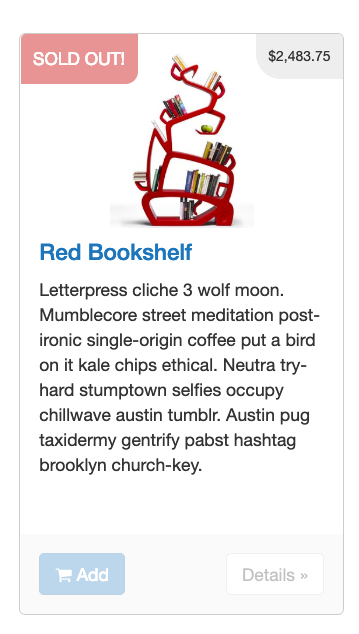
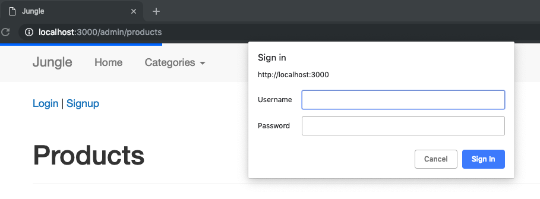
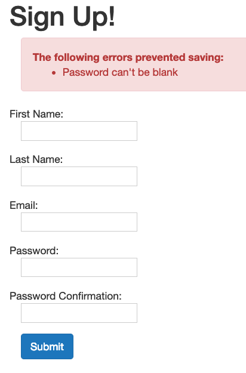
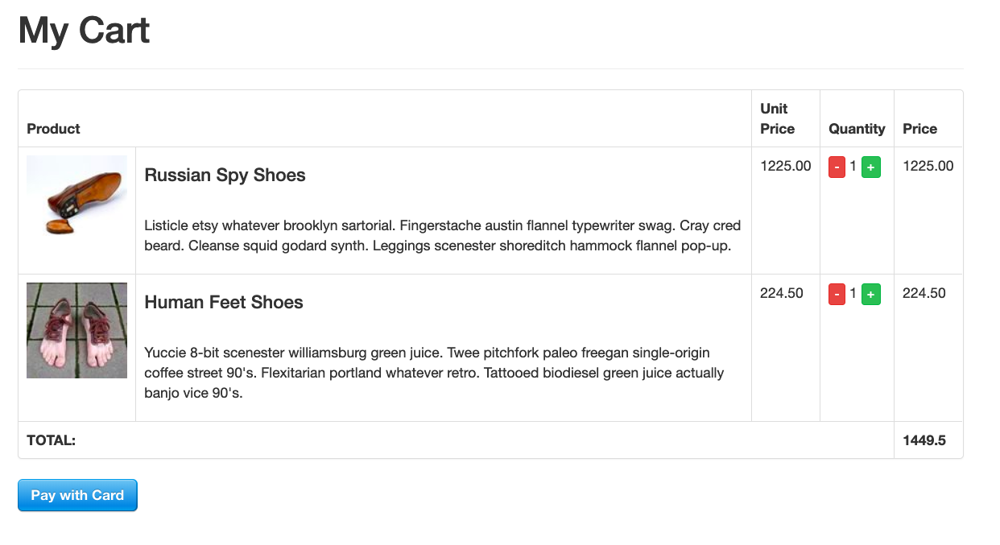
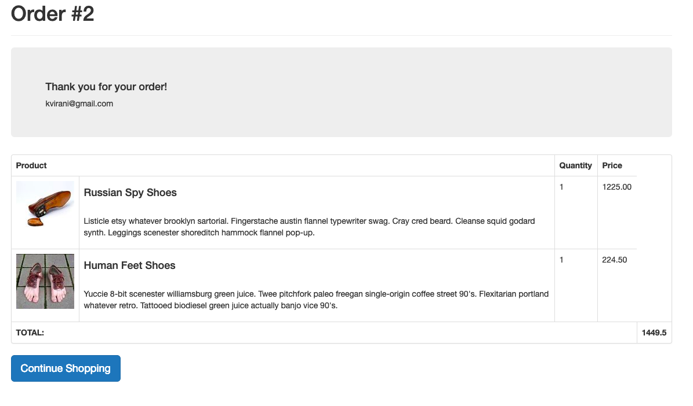
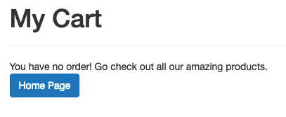
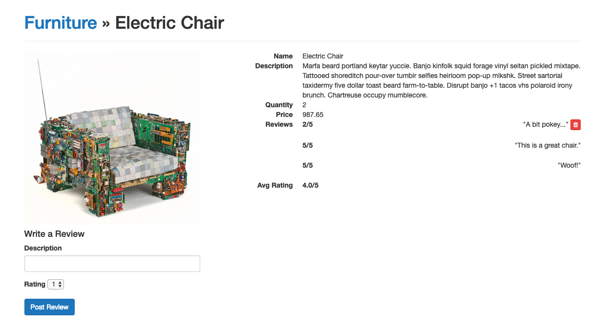

# Jungle

A mock sales app to practice using debugging and adding features to an existing Rails project.

## Features
* Sold out badge
  * 
* Basic HTTP Authentication for Admin Access
  * 
* User Registration, with relevant error messages
  * 
* Order Details displayed before and after purchase (incl. email)
  * 
  * 
* Empty Cart Message
  * 
* Product Ratings & Reviews
  * Logged-in users can write new reviews and delete their own posted reviews
  * Users and visitors can see all reviews
  * Average Rating is listed
  * 

## Setup

1. Fork & Clone
2. Run `bundle install` to install dependencies
3. Create `config/database.yml` by copying `config/database.example.yml`
4. Create `config/secrets.yml` by copying `config/secrets.example.yml`
5. Run `bin/rake db:reset` to create, load and seed db
6. Create .env file based on .env.example
7. Sign up for a Stripe account
8. Put Stripe (test) keys into appropriate .env vars
9. Run `bin/rails s -b 0.0.0.0` to start the server

## Stripe Testing

Use Credit Card # 4111 1111 1111 1111 for testing success scenarios.

More information in their docs: <https://stripe.com/docs/testing#cards>

## Dependencies

* Rails 4.2 [Rails Guide](http://guides.rubyonrails.org/v4.2/)
* PostgreSQL 9.x
* Stripe
